# Dependency Graph

Arrows point from a module to the module it depends on.

```mermaid
%%{init: {"flowchart": {"diagramPadding": 24, "nodeSpacing": 64, "rankSpacing": 72}, "themeVariables": {"fontSize": "14px"}}}%%
flowchart TD
  cli["apps/cli<br/>CLI harness"]
  authCli["apps/cli/auth"]
  selection["apps/cli/conversationSelection"]
  history["apps/cli/conversationHistory"]
  commands["apps/cli/commands"]
  render["apps/cli/render"]

  agent["core/agent<br/>Agent"]
  memoryInterface["core/memory<br/>AgentMemory interface"]
  modelInterface["core/model<br/>ModelClient interface"]
  toolsCore["core/tools<br/>Tool + ToolRegistry"]
  conversations["core/conversations<br/>ConversationManager"]
  conversationStore["core/conversations<br/>ConversationStore interface"]
  configInterface["core/config<br/>AgentConfigStore interface"]
  authInterface["core/auth<br/>TokenStore interface"]
  errors["core/errors<br/>AgentError"]

  simpleMemory["adapters/memory/simple-linear<br/>SimpleLinearMemory"]
  fileSystem["adapters/file-system<br/>JSON config/token<br/>conversation stores"]
  codexAuth["adapters/codex/auth<br/>Codex auth"]
  codexResponses["adapters/codex/responses<br/>CodexModelClient"]
  mathTool["adapters/tools<br/>MathTool"]

  cli --> authCli
  cli --> selection
  cli --> history
  cli --> commands
  cli --> render
  cli --> agent
  cli --> conversations
  cli --> simpleMemory
  cli --> fileSystem
  cli --> codexAuth
  cli --> codexResponses
  cli --> mathTool
  cli --> toolsCore

  authCli --> authInterface
  selection --> conversations
  selection --> configInterface
  history --> conversations
  commands --> configInterface
  render --> agent

  agent --> memoryInterface
  agent --> modelInterface
  agent --> toolsCore

  conversations --> conversationStore
  conversations --> errors

  simpleMemory --> memoryInterface
  simpleMemory --> conversations
  simpleMemory --> modelInterface

  fileSystem --> configInterface
  fileSystem --> conversationStore
  fileSystem --> authInterface
  fileSystem --> errors

  codexAuth --> authInterface
  codexAuth --> errors
  codexResponses --> modelInterface
  codexResponses --> errors

  mathTool --> toolsCore
```

The intended dependency direction is `apps -> adapters -> core interfaces` and `apps -> core feature modules`. Core feature modules may depend on core interfaces, but not on adapters.
